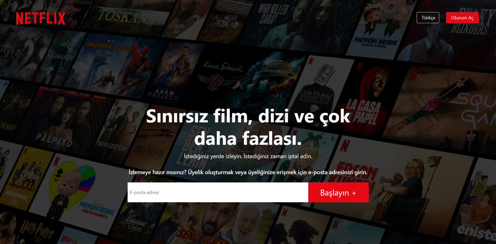
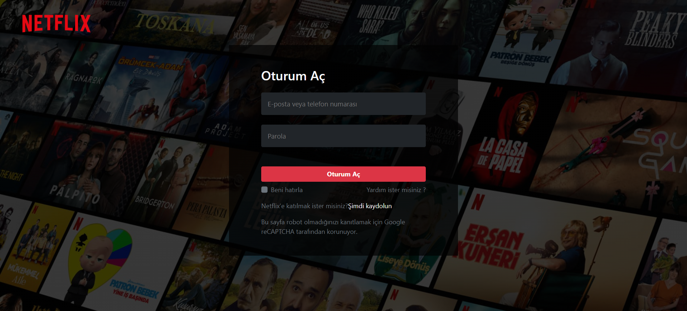
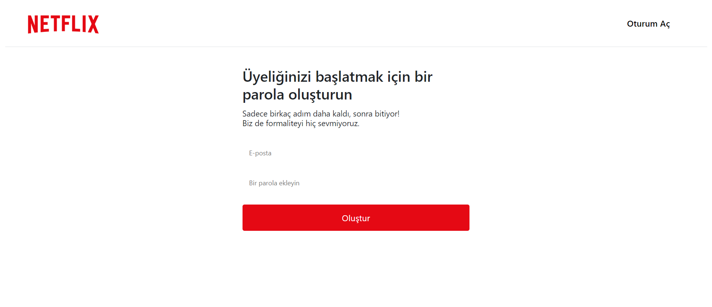

# About The Project

A movie site project using ReactJS and Bootstrap and using Netflix's design. The project has 2 types of user login as 'admin' and 'user' with username and password. With the 'Admin' entry, it is possible to add movies to the system and delete movies from the system. 'User' entry can only see the movie in the system and add and remove it from the list. 

'Json-Server' is used as 'localhost' in the project and it is running on port 3001. Users, movie list, and user movie list are kept in this 'Json-Server' file.

## Images

### Home Page

### Login Page

### New User Page

## Start The Project

For installing 'npm' files in the project
### `npm install`

'json-server' must be started in project for 'api' requests to work
### `json-server --watch --port 3001 userlist.json`

To get the project up and running
### `npm start`

## Languages and Libraries

<li>CSS
<li>Bootstrap
<li>Javascript
<li>ReactJS

## Contact

Oğuz Adıgüzel [Linkedin](https://www.linkedin.com/in/oğuz-adıgüzel-2672a8242). - oguz_adiguzel@outlook.com

Project Link : [https://github.com/oguz-adiguzel/React-Film-App](https://github.com/oguz-adiguzel/React-Film-App).

